# MSDS19033_COVID19_DLSpring2020
This repository contains code and results for COVID-19 classification assignment by Deep Learning Spring 2020 course offered at Information Technology University, Lahore, Pakistan. This assignment is only for learning purposes and is not intended to be used for clinical purposes.

## DataSet
https://drive.google.com/open?id=1-HQQciKYfwAO3oH7ci6zhg45DduvkpnK&authuser=0

## Tuning Weights Link

https://drive.google.com/open?id=1TFjIwvYr7faSxU7sfkuofxHjJRdPB51w

## Accuracies and Confusion Matrix

## Addition of FC layers and Fine Tuning of FC layers only

###### VGG-16:

No. of Layers fined tuned = All FC layers

Validation:
  
  Confusion matrix:
  
   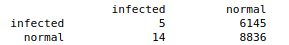

  Accuracy = 59%
  
  F1 Score = 32%
  
Testing:

  Confusion Matrix:
    
   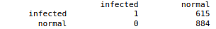

    
  Accuracy = 59%
  
  F1 Score = 44%
  
###### Res-Net18:

No. of Layers fined tuned = All FC layers

Validation

  Confusion matrix:
    
  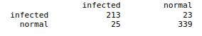

    
  Accuracy = 91%
  
  F1 Score = 89%
  
Testing

  Confusion Matrix:
  
  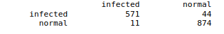

  Accuracy = 96%
  
  F1 Score = 99%

## **********Fine Tuning of Entire Network************

###### VGG-16:

No. of Layers fined tuned = All FC Layers + Conv Layers

Validation

  Confusion matrix:
  
   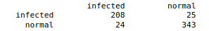

  Accuracy = 59%
  
  F1 Score = 23%
  
Testing

  Confusion Matrix:
  
   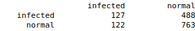

  Accuracy = 59%
  
  F1 Score = 32%
  
###### ResNet18:

Validation

  Confusion matrix:
  
  

  Accuracy = 91%
  
  F1 Score = 89%
  
Testing

  Confusion Matrix:
  
   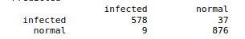

  Accuracy = 96%
  
  F1 Score = 100%
  
## ***********Fine Tuning of Few Layers**************

###### VGG16

No. of Layers fined tuned = All FC Layers + Few Conv Layers

Validation

  Confusion matrix:
  
   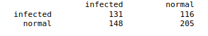

  Accuracy = 55%
  
  F1 Score = 49%
  
Testing

  Confusion Matrix:
  
   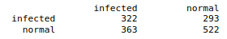

  Accuracy = 56%
  
  F1 Score = 49%

###### ResNet18:

Validation

  Confusion matrix:
  
  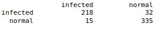

  
  Accuracy = 91%
  
  F1 Score = 89%
  
Testing

  Confusion Matrix:

  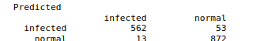

  Accuracy = 96%
  
  F1 Score = 100%
  

